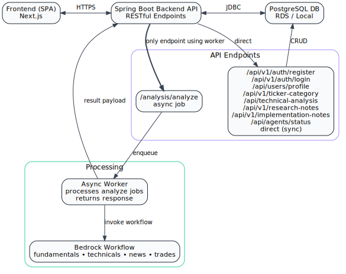
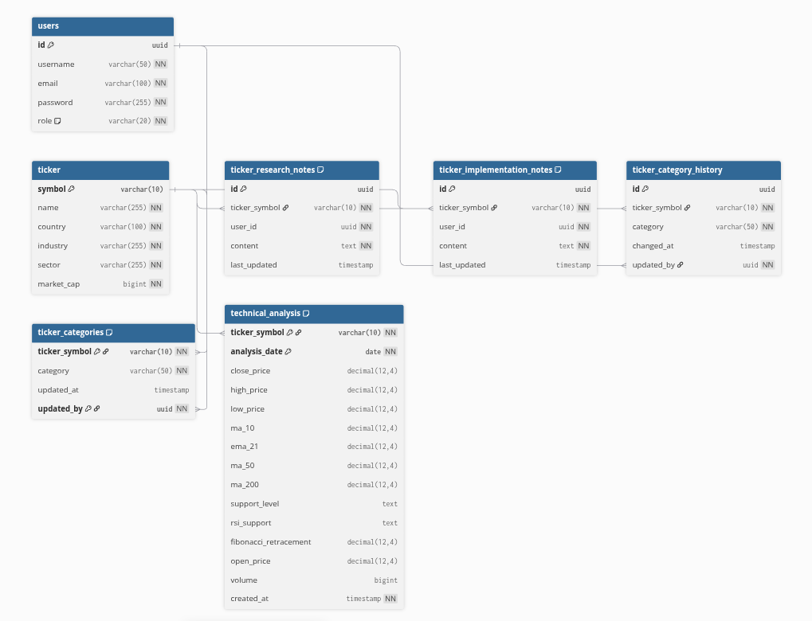

# TraderDeck Backend

## Overview
TraderDeck Backend powers the core analysis, picks, and orchestration logic for the TraderDeck platform. It is built with Spring Boot and designed for cloud-native, scalable, and resilient operation behind AWS CloudFront and ALB.

## Architecture Diagram

## Key Features
- **Asynchronous Stock Analysis:** Handles long-running AI/Bedrock workloads using a job queue and polling pattern to avoid CloudFront timeouts.
- **Multi-Agent Orchestration:** Coordinates multiple agents (fundamentals, technicals, news, trade synthesis) for comprehensive analysis.
- **RESTful API:** Exposes endpoints for analysis requests, picks, ticker management, job status polling, and agent management.
- **Integration:** Connects to AWS Bedrock, S3, RDS, and other cloud resources.

## API Endpoints & Functionality

TraderDeck Backend exposes a comprehensive set of RESTful API endpoints:

- **Agent Workflow**
  - `POST /analysis/analyze` – Submits a stock analysis request (async, returns jobId)
  - `GET /analysis/analyze/{jobId}` – Polls for job status/results

- **User Authentication & Management**
  - `POST /api/v1/auth/register` – Registers a new user
  - `POST /api/v1/auth/login` – Authenticates user, returns JWT token
  - `GET /api/users/profile` – Retrieves authenticated user profile

- **Ticker & Picks Management**
  - `POST /api/v1/ticker-category/update` – Update ticker category
  - `GET /api/v1/ticker-category/current/{tickerSymbol}` – Get current category for a ticker
  - `GET /api/v1/ticker-category/current-all` – Get current categories for multiple tickers
  - `GET /api/v1/ticker-category/history/{tickerSymbol}` – Get category history for a ticker

- **Technical Analysis**
  - `GET /api/technical-analysis/{ticker}?date=YYYY-MM-DD` – Get technical analysis for a ticker on a specific date
  - `POST /api/technical-analysis` – Create new technical analysis record

- **Research Notes**
  - `GET /api/v1/research-notes?tickerSymbols=AAPL,MSFT` – Get research notes for tickers
  - `GET /api/v1/research-notes/{tickerSymbol}` – Get research note for a ticker
  - `POST /api/v1/research-notes` – Create or update a research note
  - `DELETE /api/v1/research-notes/{id}` – Delete a research note by ID

- **Implementation Notes**
  - `GET /api/v1/implementation-notes?tickerSymbols=AAPL,MSFT` – Get implementation notes for tickers
  - `GET /api/v1/implementation-notes/{tickerSymbol}` – Get implementation note for a ticker
  - `POST /api/v1/implementation-notes` – Create or update an implementation note
  - `DELETE /api/v1/implementation-notes/{id}` – Delete an implementation note by ID

- **Other Endpoints**
  - `GET /api/agents/status` – Returns agent status information

All endpoints are secured via JWT authentication where required.

## App Backend: Agent Orchestration
TraderDeck Backend (Spring Boot) orchestrates agentic analysis workflows through a single API call. When a user requests a stock analysis:
- The backend receives the request and triggers the entire agent workflow (via Bedrock flow), which returns outputs from all agents (fundamentals, technicals, news, trades) in one response.
- The backend does not call each agent Lambda individually; the workflow coordinates all agent logic and aggregation.
- The analysis flow can take up to 1 minute to complete, so the backend uses an asynchronous job pattern: it immediately returns a job ID, and the frontend polls for results until the flow completes.
This asynchronous implementation ensures that the system remains responsive and scalable, even under high load or during long-running analysis workflows. Additionally, it addresses limitations imposed by AWS CloudFront and ALB, such as timeouts for long-running requests, by decoupling the processing logic from the request-response cycle.
- For a detailed explanation of the async architecture and rationale, see [Asynchronous Stock Analysis Architecture: Decoupling Long-Running Bedrock Workloads to Overcome CloudFront Timeouts.md](Asynchronous%20Stock%20Analysis%20Architecture:%20Decoupling%20Long-Running%20Bedrock%20Workloads%20to%20Overcome%20CloudFront%20Timeouts.md).
- For agent implementation details, see the [trader-deck-agents README](../trader-deck-agents/README.md).

## User Authentication
- Registration and login are managed via dedicated endpoints.
- Passwords are securely hashed using BCrypt.
- JWT tokens are issued for session management and API access.
- Admin user seeding is supported for initial setup.

## Database Design & Modeling

## Logging & Configuration
- Centralized logging for API requests, agent orchestration, and error handling.
- Environment-based configuration for development and production.
- Secure management of secrets and credentials.

## Security
- JWT-based authentication for all sensitive endpoints.
- Passwords are never stored in plaintext.
- Role-based access control for admin features.

## Cloud Integration
- Runs behind AWS ALB and CloudFront.
- Connects to RDS (PostgreSQL), S3 buckets, and Bedrock for AI workloads.
- Follows best practices for security groups, IAM roles, and secrets management.
